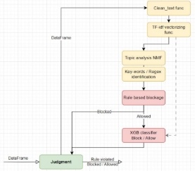
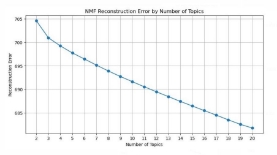
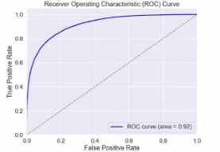

Detecting Sensitive Email Content NLP & A Machine Learning Approach

Efi Pecani

1. **Introduction & Problem Formulation**
1. Domain Overview

Email communication is integral to corporate operations but poses significant risks when sensitive information is mishandled. The collapse of Enron underscores the critical need for stringent data loss prevention (DLP) policies. The project explores the implementation of machine learning (ML) algorithms and nlp techniques to automate the enforcement of these policies, aiming to prevent unauthorized information dissemination within and outside a corporation.

2. Problem Description

The task involves developing a model to classify emails based on predefined DLP rules set by a corporate information security officer (CISO). The model determines whether an email should be blocked or allowed to pass through the company's email gateway. Applying rules over these emails, requires identifying the following information from each email structure: Geography / company / internal division - orientation, Clearance Levels (Job titles), Personal PII indicated or implied to (QID), Sensitive topics discussed (such as Legal, Finance & business)

Main challenges during data processing - while identifying Enron employees is simple (@enron.com), internal division and geography location (EU vs US) need additional data preprocessing to extract, not indicated directly in many cases.

Clearance Levels are not indicated, need to classify each sender and receiver as to their job title (VPs, Directors, C-level employees or else).

Personal PII and Sensitive topics have no specifying attribute and need to be identified by using more advanced techniques of NLP, recognizing content and topics key words and classifying the email accordingly.

Policy Group #1 – Internal Data Sharing Limitations and Geo-fencing:

- Rule 1.1 – Legal related emails cannot be transferred between ECT and EES within the corporation .
- Rule 1.2 – financial data cannot be transferred between the EU and USA.

Iftach Danciger

- Rule1.3 – no business or financial emails/documents can leave corporation perimeter. Policy Group #2 – Privacy and Sensitivity:
- Rule 2.1 – emails containing finance information with PII or QID must not leave ECT company.
- Rule 2.2 – sensitive business information can be passed only between VPs, Directors, and C-level employees.
- Rule 2.3 – block mails containing PII or number of QIDs sent outside the corporation.
3. Existing Methods and Our Proposal

   Traditional methods rely heavily on rule-based systems, which lack flexibility and adaptability. Our approach leverages state-of-the-art ML techniques to create a more dynamic and efficient DLP system. We propose a supervised learning model trained on a labeled dataset of Enron emails, which will classify emails as either permissible or not based on the content and context relative to specific DLP rules. We Believe the combination of rule based layer, unsupervised Topic analysis and ML classification will bring the best confidence in the result.

2. **Related Work**
* TF-IDF (Term Frequency-Inverse Document Frequency) is a statistical measure that evaluates how relevant a word is to a document in a collection of documents. It combines two metrics: the term frequency (how many times a word appears in a document) and the inverse document frequency (the word frequency across all documents in the corpus). [This approach helps identify words that are more descriptive and important for your text](https://monkeylearn.com/blog/what-is-tf-idf/), crucial in order to understand what are the key words we need in order to use for classification (content, topics, etc).
* Non-negative Matrix Factorization (NMF) is a powerful technique used in natural language processing (NLP) to uncover hidden topics within a collection of short text documents. Although it’s unsupervised, it helps us find the best key-words that combine relevant topics for our classification, also for removing irrelevant words from our email body data.
* The XGBoost (eXtreme Gradient Boosting) model is a popular machine learning algorithm known for its speed and performance. It’s an implementation of gradient boosted decision trees designed for speed and performance, and it’s often used for supervised learning

1

![ref1]

tasks such as classification and regression. using the vectorized TF-idf output, we can implement the model over these high frequency words. After model training, we can visit back the most significant words used for best separation.

3. **Dataset Description**

The Enron Email Dataset comprises approximately 500,000 emails collected before the company's collapse. These emails have been labeled by the CISO, and available for models training and validations.

The dataset is a pickle format, easy to upload as a pandas DataFrame, including the following columns: 'Date', 'From', 'To', 'X-To', 'X-From', 'X-cc', 'X-bcc', 'Subject', 'email\_body', 'verdict' (Blocked / Allowed), 'violated\_rules'.

'From', 'To' columns will assist with rule based functions - finding employees job titles, Enron vs non-enron, EES vs ECT internal orientation, EU vs US.

'Subject', 'email\_body' columns will contain all the key-words we need for content and Topic analysis (PII, Financial / Business / Legal related).

'verdict', 'violated\_rules' columns will be our labeled Targets for model training & validation, we can use them to find the best keywords to classify different violated rules.

4. **Exploratory Data Analysis (EDA)**

   Initially we broke down the policy rules into required attributes (PII, finance/Business/legal, Enron/ECT/EES, US/EU, Job title) and start to look at samples of the dataset.

   For example - without seeing clear EU / US attributes, we tried analyzing by looking at the different working hours - although we see GMM of 2 different time zones, but the separation between them is not sufficient.

*figure 1 - work hours email distribution*

Taking the ‘email\_body’ column, running pre-process cleaning (stop-words, lemmatizer, remove digits and remove irrelevant words), then looking at the most frequent words - in an attempt to find best key-words for Topic analysis:

*figure 1 - word frequency count*

Enron is known as an energy company - we can see some high frequency words related to their business: power, energy, gas.. we can see legal and finance related words: service, contract, corp, credit, product, stock. Also geographic key-words: california, Houston, state, america.

Breaking down the 'From', 'To', 'X-To', 'X-From' columns in order to find keywords such as “ECT’, ‘EES’, US, EU, Hout - not clear structure but the key-words do appear enough to base some rule enforcement.

after NMF unsupervised grouping to topics, we were able to get following with 5 top frequency ke-words:

We started to look at different Enron employee names: “Debra”, “Mann”, “Kay”, “Dperlin” - by browsing the web we found relevant personal, all related to legal departments in Enron. Wondering the meaning of

2
![ref1]

‘hourahead’ - we browsed and found it to be related to auctions - seems to be related to Finance issues. Looking at topic1 - power, energy, gas are all business related key-words of Enron.

5. **Method**
1. Model Overview

We start by pre-processing the ‘email\_body’ (cleaning function) - lower capital letters, using the “re” Regex library we collapse whitespace, remove all integers and floats, we gathered a “clean\_out\_list” to remove words that later on have very high frequency but have no effect on our research.

Using TF-idf we vectorize the ‘cleaned\_email’ key-words, being used for the next model classifications.

Using an unsupervised NMF model we are able to distinguish legal / business / finance related topics (by most significant key-words.

using simple regex and key-word detections in the ‘email\_body’, 'From', 'To', 'X-To', 'X-From' columns, we add additional columns determining binary: PII content, enron vs non-eron, ECT vs EES, US vs EU.

Using a web-based dictionary - we are able to detect emails of management personnel in additional binary columns.

Combining key-word and topic analysis - we enforce each rule based on it’s policy, and the binary columns we have - adding each rule name to the “violated\_rules” string. If any rule was violated, adding “BLOCKED to the “verdict” column, “ALLOWED” otherwise.

Second layer of model prediction is a XGBoost classifier, trained over the cleaned vectorized data, predicting BLOCK vs ALLOW. only “ALLOWED” mails from the rule-based layer will be predicted using the XGBoost, determining if it is Blocked.

2. Feature Selection and Parameter Tuning
* Topic analysis done by using unsupervised NMF separation of features, in this case key-words - analyzed reconstructed Error vs number of topics, unclear optimal point (no clear “elbow”), decided to continue with 5 topics that made sense using their keywords.

*figure 2 - NMF Reconstruction Error by number of topics*

* Grid-search for XGBoost found optimal point at learning rate=0.2, max\_depth=6, n\_estimators=200

  - this improved the F1 score to 0.5

6. **Results**

The F1 score is important because it provides a balance between precision and recall. It’s particularly useful in scenarios where both false positives and false negatives are crucial, or when the data is imbalanced. The F1 score is the harmonic mean of precision and recall, ensuring that both metrics are taken into account. It ranges from 0 to 1, with 1 being the best possible F1 score.

Testing the XGBoost model 70 / 30 - we got best decent results (after number of fine-tuning and different models):

high accuracy and precision, but most important, looking at the f1-score we were able to improve significantly.

3
![ref1]

*figure 1 - flow chart of classification functions structure*

*CM for XGBoost*

*ROC curve for XGBoost*

important to note that the data is pretty unbalanced - majority of the emails are allowed (138512 vs 16709).

7. **Limitationsand Future Work**

Our main limitation is prior subject Knowledge - Enron scandal happened over 23 years ago, much is lost or hard to find in simple web scraping - so we needed to guess some of the attributes, locations and general formats.

In future work, we would continue to search the web for more knowledge on employees, on financial / business / legal aid for classification - trying to clean the email bodies with additional methods.

**References**

1. Executive Bios of Enron from online search - [Enron: Executive Bios (enroncorp.com)](https://enroncorp.com/corp/pressroom/bios/)
1. TF-idf good elaboration and python implementation - [Understanding TF-IDF (Term Frequency-Inverse Document Frequency) - GeeksforGeeks](https://www.geeksforgeeks.org/understanding-tf-idf-term-frequency-inverse-document-frequency/)
1. Enron ‘hourahead’ search ‘[https://www.risk.net/commodities/energy/24413 92/enrons-california-schemes-haunt-regulators- 15-years-later](https://www.risk.net/commodities/energy/2441392/enrons-california-schemes-haunt-regulators-15-years-later)
4

[ref1]: Aspose.Words.46bf1cf1-30aa-48db-8a5a-b1f86a348137.001.png
